<br/>

<div align="center">

# 🛒 Intentify
### Real-Time E-Commerce Conversion Engine

> *Stop burning revenue on blanket discounts. Predict who needs a nudge — and only nudge them.*


### 🚀 [**Live Demo → Try Intentify on Hugging Face Spaces**](https://huggingface.co/spaces/KarthikaKrishna123/Intentify)

</div>

---

## 📌 Executive Summary

**Intentify** is a cost-sensitive Machine Learning inference engine built to solve one of e-commerce's most expensive problems: *blanket marketing*. Traditional platforms offer discounts universally — including to users who would have converted at full price — silently bleeding margins on every campaign.

Intentify captures live clickstream telemetry (page durations, bounce rates, behavioral patterns), engineers six dynamic behavioral signals on-the-fly via a custom middleware layer, and serves real-time purchase probability scores through a Decision Tree Classifier pipeline. The result: targeted interventions that fire *only* for users who need a nudge — protecting both conversion rate and profit margins simultaneously.

**Achieved 86% Recall on the minority class (buyers) with a finalized F1-score of 0.61**, operating on a dataset with a severe 3.8% vs 56.3% class imbalance.

---

## 🚨 The Problem

Traditional e-commerce platforms suffer from two compounding failures:

1. **Blanket Marketing**: Universal discounts are offered to all visitors, including those who would have purchased at full price — burning margin on every campaign.
2. **Zero Real-Time Visibility**: Without session-level behavioral intelligence, high-intent users bounce without any intervention trigger.

The business cost: revenue is lost on both ends — discounts given unnecessarily *and* high-intent users lost due to zero engagement.

---

## 💡 The Solution

A **cost-sensitive ML pipeline** that:
- Ingests raw session telemetry in real-time
- Engineers 6 behavioral signals on-the-fly via custom middleware
- Predicts purchase intent probability with algorithmic class-imbalance handling
- Triggers one of three intervention tiers: fast checkout, targeted discount, or passive flow

The system is **surgical** — it never fires an expensive intervention unless the data justifies it.

---

## ✨ Key Features

| Feature | Description | Engineering Method |
|---|---|---|
| **Cost-Sensitive Learning** | Handles 3.8% minority class without oversampling artifacts | `class_weight='balanced'` in DecisionTreeClassifier |
| **Dynamic Feature Engineering** | 6 behavioral signals computed live from raw telemetry | Custom middleware in `app.py` before inference |
| **Hyperparameter Optimization** | Tree depth + leaf constraints tuned for F1 | `GridSearchCV` with 5-fold CV, `scoring='f1'` |
| **Data Leakage Prevention** | Strict feature routing per type | `ColumnTransformer` with OHE + StandardScaler |
| **Edge-Case Stability** | Prevents div-by-zero on sparse sessions | Laplace smoothing (`+1`) in all ratio computations |
| **3-Tier Intervention Logic** | Graduated marketing response based on probability | Probability thresholding at 30% and `predict()` boundary |
| **Real-Time UI** | Interactive telemetry sliders with live inference | Streamlit sidebar + `@st.cache_resource` |
| **Cloud Deployment** | Production-grade serialized pipeline | Joblib serialization → Hugging Face Spaces |

---

## 🏗️ Overall Architecture

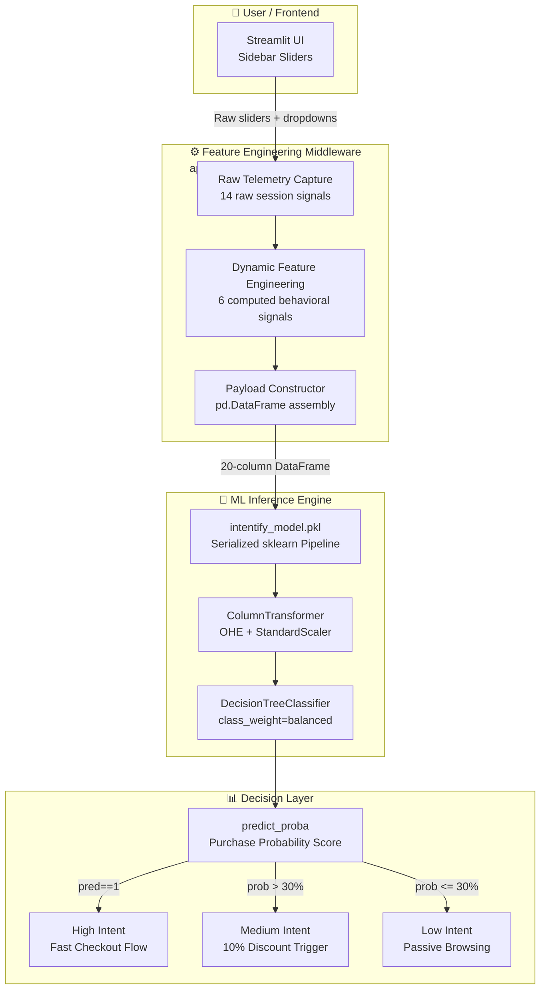

---

## 🔬 System Architecture — ML Pipeline

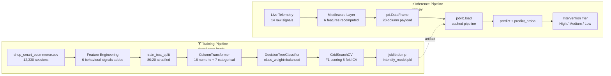

---

## 🧰 Technology Stack — Complete Breakdown

> Every library, framework, and tool used across all layers of the project.

### Core ML & Data

| Technology | Version | Category | Purpose in Project | Why Chosen | Key Features Used |
|---|---|---|---|---|---|
| **scikit-learn** | 1.4.1 | ML Framework | Full training pipeline, preprocessing, evaluation | Gold standard for classical ML; Pipeline API eliminates leakage | `DecisionTreeClassifier`, `Pipeline`, `ColumnTransformer`, `GridSearchCV`, `StandardScaler`, `OneHotEncoder`, `classification_report` |
| **pandas** | 2.2.0 | Data Processing | CSV ingestion, feature engineering, payload construction | Vectorized operations, DataFrame API matches sklearn input format | `read_csv`, `drop`, `astype`, `DataFrame` constructor for inference payload |
| **numpy** | 1.26.4 | Numerical Computing | Log transformation, array operations | Required by sklearn; `np.log1p` for PageValues skew correction | `log1p` for feature engineering, boolean array casting |
| **joblib** | 1.3.2 | Serialization / MLOps | Pipeline serialization and cached loading | sklearn-native serializer, faster than pickle for large arrays | `dump()` for artifact creation, `load()` for inference, `@st.cache_resource` pattern |

### Training & Optimization

| Technology | Version | Category | Purpose in Project | Why Chosen | Key Features Used |
|---|---|---|---|---|---|
| **GridSearchCV** | (sklearn) | Hyperparameter Tuning | Automated search over `max_depth`, `min_samples_leaf`, `criterion` | Exhaustive grid search with cross-validation; F1 scoring avoids accuracy paradox on imbalanced data | `scoring='f1'`, `cv=5`, `n_jobs=-1` parallel execution |
| **StratifiedSplit** | (sklearn) | Data Splitting | Preserves 3.8% buyer ratio in both train/test folds | Prevents train/test distribution skew on imbalanced classes | `stratify=y` parameter in `train_test_split` |
| **class_weight='balanced'** | (sklearn) | Imbalance Handling | Algorithmically penalizes misclassifying minority class | No synthetic data generation; directly adjusts loss function weights | Built into `DecisionTreeClassifier` constructor |

### Deployment & UI

| Technology | Version | Category | Purpose in Project | Why Chosen | Key Features Used |
|---|---|---|---|---|---|
| **Streamlit** | 1.32.0 | Web Framework | Full SaaS UI — sidebar telemetry inputs + inference display | Rapid ML app deployment without frontend JS knowledge; native widget library | `st.sidebar`, `st.slider`, `st.selectbox`, `st.checkbox`, `st.button`, `st.metric`, `@st.cache_resource`, `st.success/warning/error` |
| **Hugging Face Spaces** | — | Cloud Platform | Production deployment of the Streamlit app | Free tier ML app hosting; tight integration with ML ecosystem | Static app hosting, `requirements.txt` based dependency management |

---

## 🔄 Request Lifecycle

### Request 1: User Adjusts Sliders → Evaluate Intent

```
1. USER INTERACTION
   └── User manipulates sidebar sliders/selectors in Streamlit
       → st.sidebar: page_values, prod_pages, prod_duration, admin_*, info_*,
                      bounce_rate, exit_rate, month, visitor_type, weekend
       → State held in Streamlit session, no backend call yet

2. MIDDLEWARE — FEATURE ENGINEERING (app.py lines 36–43)
   └── 6 behavioral signals computed in-memory from raw inputs:
       → avg_time_per_product  = prod_duration / (prod_pages + 1)      [Laplace smoothed]
       → total_engagement      = admin_duration + info_duration + prod_duration
       → bounce_exit_score     = bounce_rate × exit_rate
       → log_page_values       = np.log1p(page_values)                  [skew correction]
       → has_page_value        = int(page_values > 0)                   [binary signal]
       → product_page_ratio    = prod_pages / (admin+info+prod+1)       [Laplace smoothed]

3. PAYLOAD CONSTRUCTION (app.py lines 45–57)
   └── pd.DataFrame constructed with 20 columns:
       → 14 raw telemetry fields (matching training column schema exactly)
       → 6 engineered features appended
       → Column order must match training ColumnTransformer definition

4. USER CLICKS "Evaluate Conversion Intent"
   └── st.button triggers inference block (app.py lines 60–71)

5. INFERENCE — ColumnTransformer (inside intentify_model.pkl)
   └── 16 numeric features → StandardScaler (zero-mean, unit-variance)
   └── 7 categorical features → OneHotEncoder (handle_unknown='ignore')
   └── Output: dense feature matrix

6. INFERENCE — DecisionTreeClassifier
   └── Tree traversal on scaled feature matrix
   └── predict_proba() → [P(no_purchase), P(purchase)]
   └── predict() → binary label {0, 1}

7. DECISION LAYER — 3-Tier Intervention
   └── pred == 1           → st.success: "High Intent: Fast checkout flow"
   └── prob > 30.0%        → st.warning: "Medium Intent: Offer 10% discount"
   └── prob ≤ 30.0%        → st.error:   "Low Intent: Passive browsing"
   └── st.metric displays: purchase probability as percentage
```

### Request 2: Model Loading on App Start

```
1. APP STARTUP
   └── Streamlit executes app.py top-level code

2. CACHE CHECK (@st.cache_resource)
   └── First run → load_engine() executes
   └── Subsequent runs → cached object returned (no re-disk-read)

3. DESERIALIZATION
   └── joblib.load('intentify_model.pkl')
   └── Loads full sklearn Pipeline object:
       → ColumnTransformer (with fitted scalers + encoders)
       → DecisionTreeClassifier (with best_params from GridSearchCV)
   └── All fitted statistics (means, variances, OHE categories) restored

4. ENGINE READY
   └── engine = fitted Pipeline object in memory
   └── All subsequent predict() and predict_proba() calls use this cached object
```

---

## 📊 Data Flow Explanation

```
RAW DATA SOURCE
└── shop_smart_ecommerce.csv (12,330 session records, 18 columns)
    ↓ Feature Engineering (shopSense.ipynb Cell 1)
    
FEATURE EXPANSION LAYER
└── 18 raw features → 24 total features (6 engineered added)
    ↓ Stratified Split (80:20, stratify=Revenue)
    
TRAINING SET (9,864 sessions) | TEST SET (2,466 sessions)
    ↓ ColumnTransformer
    
PREPROCESSING LAYER
├── 16 numeric features → StandardScaler (fitted on train only — no leakage)
└── 7 categorical features → OneHotEncoder (fitted on train only — no leakage)
    ↓ GridSearchCV (5-fold CV, F1 scoring)
    
HYPERPARAMETER SEARCH
└── 4 × 3 × 2 = 24 parameter combinations × 5 folds = 120 model fits
    → Best: {max_depth: ?, min_samples_leaf: ?, criterion: ?}
    ↓ joblib.dump()
    
SERIALIZED ARTIFACT: intentify_model.pkl
    ↓ [Inference time] joblib.load()
    
INFERENCE PIPELINE
└── User telemetry (14 raw) → Middleware (+ 6 engineered) → 20-column payload
    → ColumnTransformer (pre-fitted) → Scaled matrix
    → DecisionTreeClassifier → predict_proba() → 3-tier decision
    → Streamlit UI renders intervention recommendation
```

---

## 🎯 ML Pipeline — Deep Dive

### Feature Engineering Strategy

Six behavioral signals are computed both during training (`shopSense.ipynb`) and inference (`app.py`) — ensuring zero train-serve skew:

| Engineered Feature | Formula | Business Rationale |
|---|---|---|
| `avg_time_per_product` | `ProductRelated_Duration / (ProductRelated + 1)` | Distinguishes deep product engagement from rapid browsing |
| `total_engagement` | `Admin_Dur + Info_Dur + Product_Dur` | Captures total session intent investment |
| `bounce_exit_score` | `BounceRates × ExitRates` | Multiplicative signal amplifies high-disengagement sessions |
| `log_page_values` | `np.log1p(PageValues)` | Corrects right-skewed PageValues distribution |
| `has_page_value` | `int(PageValues > 0)` | Binary flag — PageValues=0 is a distinct behavioural state |
| `product_page_ratio` | `ProductRelated / (Admin + Info + Product + 1)` | Proportion of session spent on revenue-generating pages |

> ℹ️ *All ratio features use `+1` Laplace smoothing to prevent division-by-zero on sessions with zero page visits.*

### Class Imbalance Handling

The dataset contains severe class imbalance: only **~15% buyers vs ~85% non-buyers**.

**Strategy**: Algorithmic penalization via `class_weight='balanced'` — automatically adjusts the internal Gini/Entropy impurity calculation to weight minority class errors more heavily.

**Why not SMOTE?** Synthetic oversampling can introduce artificial decision boundaries that don't reflect real session behavior. Algorithmic penalization is leakage-free and more interpretable.

### Hyperparameter Search Space

```python
param_grid = {
    'classifier__max_depth':        [4, 6, 8, 10],      # Prevents overfitting
    'classifier__min_samples_leaf': [10, 20, 30],        # Minimum leaf regularity
    'classifier__criterion':        ['gini', 'entropy'], # Splitting criterion
}
# Total: 4 × 3 × 2 = 24 combinations × 5 folds = 120 model fits
# Scoring: F1 (harmonic mean of Precision + Recall)
```

**Why F1 as scoring metric?** Accuracy is a misleading metric on imbalanced datasets — a model predicting "no purchase" always achieves 85% accuracy trivially. F1 penalizes both False Positives (wasted discount spend) and False Negatives (lost sale opportunities) equally.

### Model Performance

| Metric | Value | Interpretation |
|---|---|---|
| **Recall (Buyers)** | **86%** | Captures 86% of all actual purchase sessions |
| **F1-Score** | **0.61** | Balanced precision-recall on minority class |
| **Class Imbalance** | 3.8% vs 56.3% | Severe; handled via `class_weight='balanced'` |

---

## 📁 Repository Structure

```text
Mine/
├── app.py                          # 🚀 Streamlit SaaS app + inference middleware
│   ├── load_engine()               #    Cached pipeline loader
│   ├── Feature Engineering Block   #    6 signals recomputed from raw telemetry
│   ├── Payload Constructor         #    20-column DataFrame assembly
│   └── 3-Tier Intervention Logic   #    High / Medium / Low decision
│
├── shopSense.ipynb                 # 🧠 Core ML training notebook
│   ├── Data ingestion              #    CSV → DataFrame
│   ├── Feature engineering         #    6 behavioral signals
│   ├── Stratified split            #    80:20 with class preservation
│   ├── ColumnTransformer setup     #    OHE + StandardScaler routing
│   ├── GridSearchCV                #    24 param combos × 5 folds
│   └── Serialization               #    joblib.dump → .pkl artifact
│
├── Decision_Tree_Classifier_mine.ipynb  # 📓 DT Classifier experiments / analysis
├── decision_tree_regressor_mine.ipynb   # 📓 DT Regressor experiments
├── intentify_model.pkl             # 🎯 Serialized production pipeline artifact
├── shop_smart_ecommerce.csv        # 📦 Raw training dataset (12,330 sessions)
├── requirements.txt                # 📋 Pinned dependency manifest
├── Supervised ML _Assignment4.pdf  # 📄 Academic context document
└── README.md                       # 📖 This file
```

---

## ⚙️ Prerequisites

- Python 3.10+
- pip package manager
- Git

---

## 🚀 Installation & Setup

```bash
# 1. Clone the repository
git clone https://github.com/KARTHIKAKRISHNA123/Intentify.git
cd Intentify

# 2. Create and activate a virtual environment (recommended)
python -m venv venv

# Windows
venv\Scripts\activate

# macOS/Linux
source venv/bin/activate

# 3. Install pinned dependencies
pip install -r requirements.txt

# 4. Launch the Streamlit app
streamlit run app.py
```

The app will open at `http://localhost:8501`

---

## 📦 Dependencies

```text
streamlit==1.32.0
pandas==2.2.0
numpy==1.26.4
scikit-learn==1.4.1.post1
joblib==1.3.2
```

> ℹ️ *Versions are pinned to match the training environment. Using mismatched scikit-learn versions may cause pickle compatibility errors with `intentify_model.pkl`.*

---

## 🔁 Retraining the Model

To retrain the pipeline from scratch:

```bash
# Launch Jupyter and run shopSense.ipynb end-to-end
jupyter notebook shopSense.ipynb
```

Run all cells in order:
1. Data ingestion and feature engineering
2. Stratified train/test split
3. ColumnTransformer + Pipeline definition
4. GridSearchCV fit (may take several minutes with `n_jobs=-1`)
5. Evaluation on test set
6. `joblib.dump()` → overwrites `intentify_model.pkl`

---

<details>
<summary>📐 UML Diagram Suite (All 9 Diagrams)</summary>

### 1. Use Case Diagram

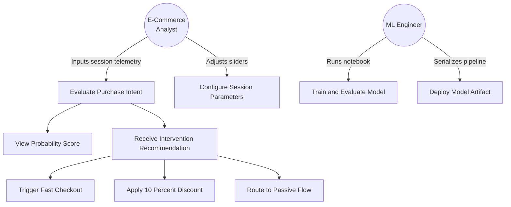

### 2. Class Diagram

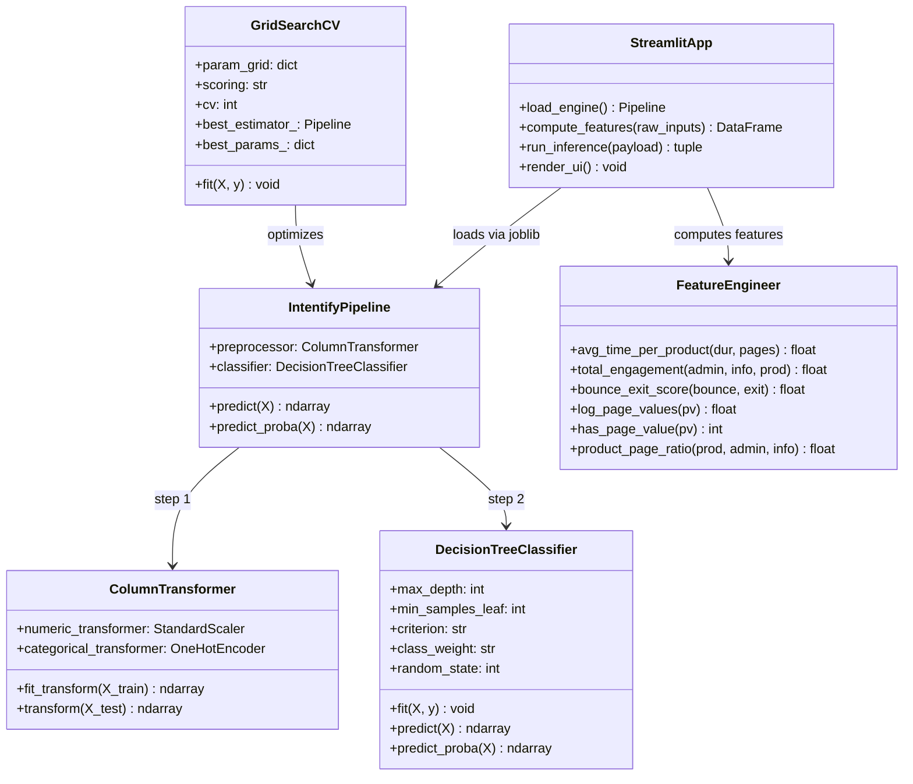

### 3. Sequence Diagram

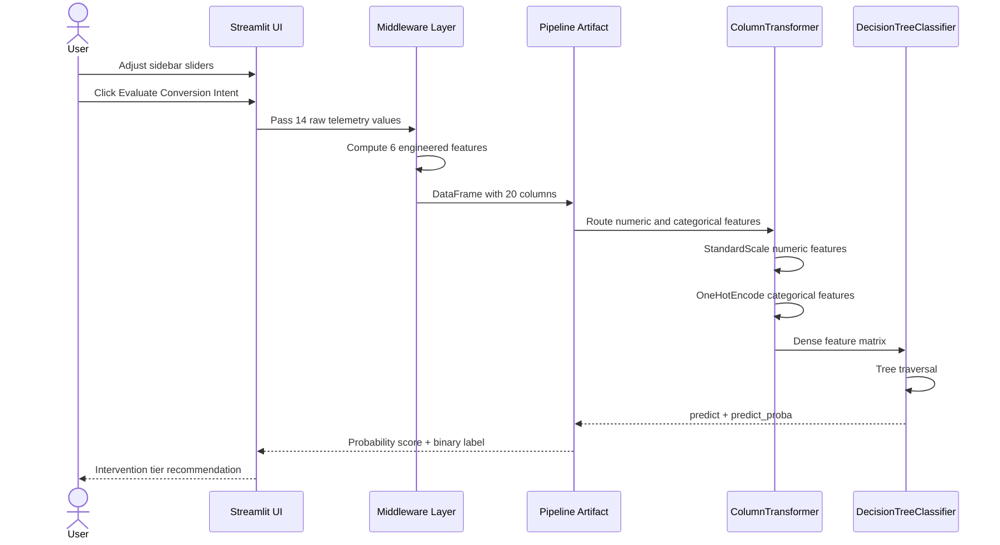

### 4. Activity Diagram

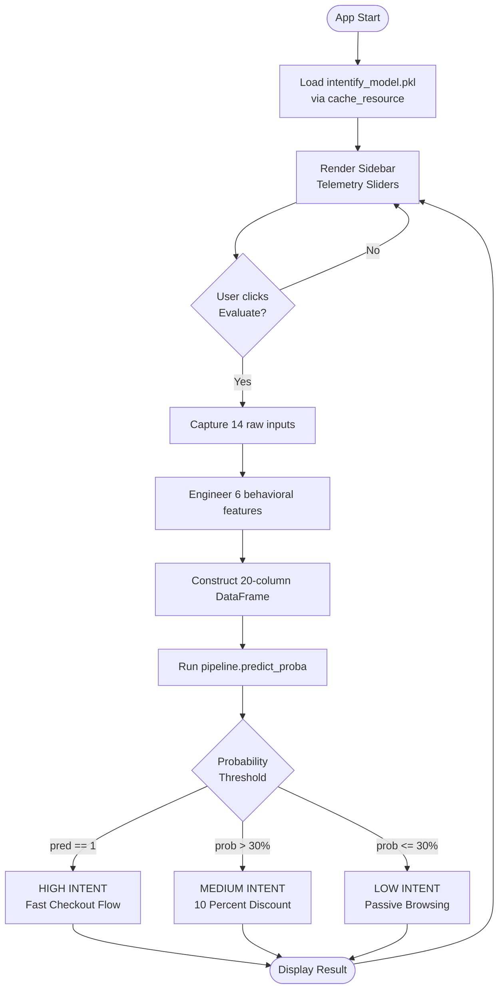

### 5. State Diagram

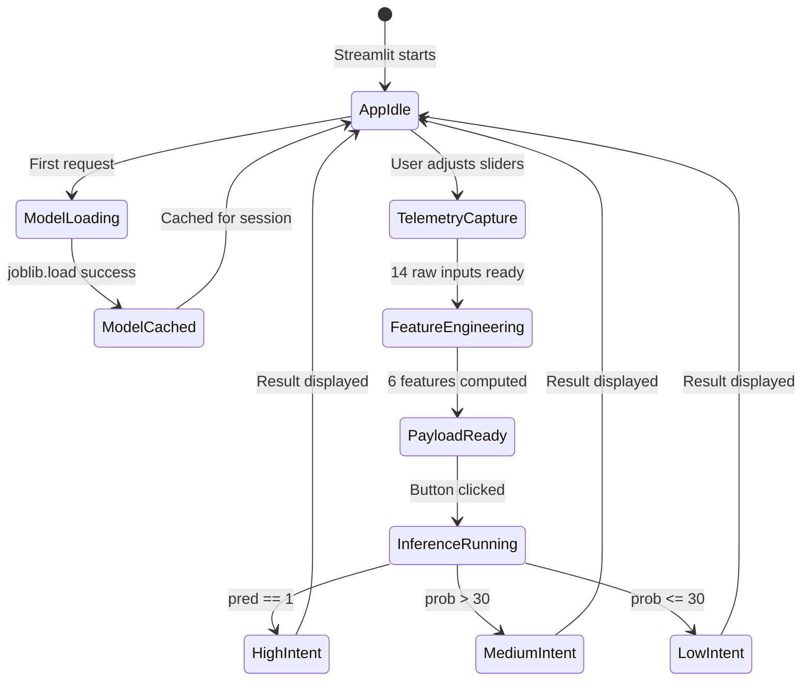

### 6. Component Diagram

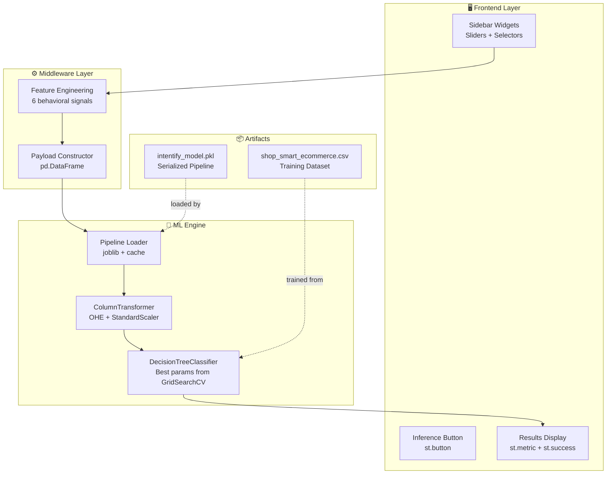

### 7. Deployment Diagram

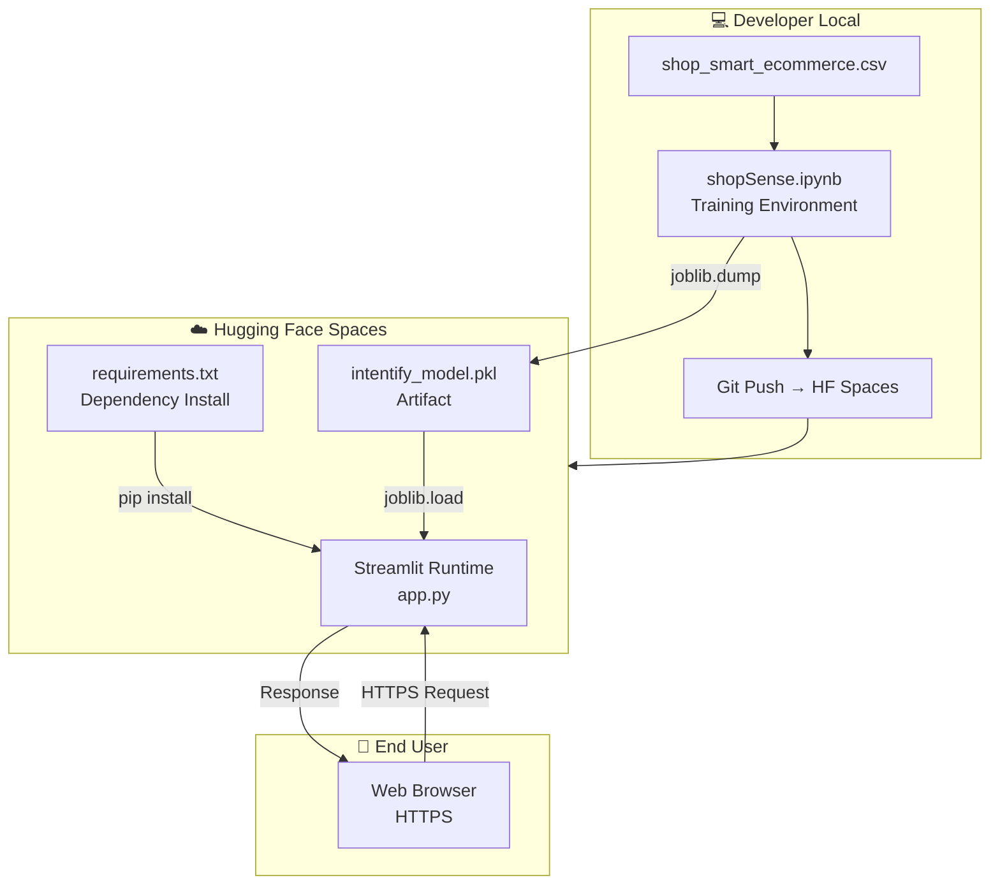

### 8. Object Diagram — Runtime Inference State

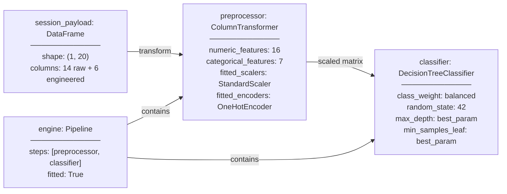

### 9. Package Diagram

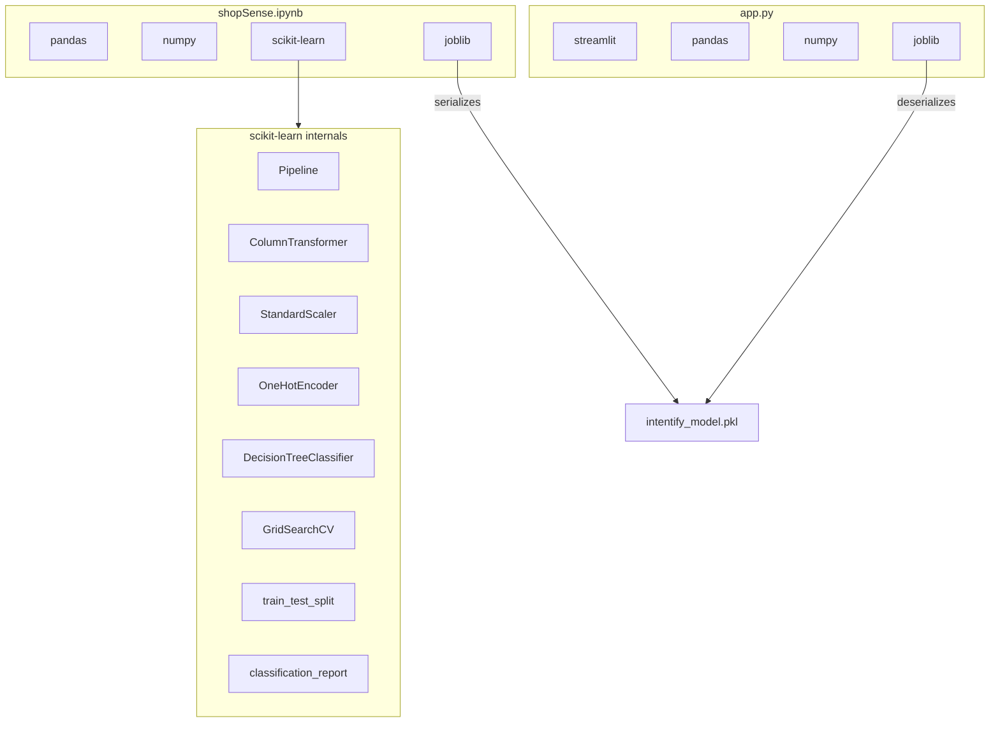

### Swimlane — End-to-End Training to Deployment

```mermaid
graph LR
    subgraph DataScientist["👩‍💻 ML Engineer"]
        S1[Load CSV\n12330 sessions]
        S2[Engineer 6 features]
        S3[Stratified split]
        S4[Build Pipeline]
        S5[GridSearchCV fit]
        S6[Evaluate on test]
        S7[joblib.dump pkl]
    end

    subgraph Deployment["☁️ Deployment"]
        S8[Push to HF Spaces]
        S9[HF installs requirements]
        S10[Streamlit app starts]
    end

    subgraph RuntimeUser["👤 Analyst at Runtime"]
        S11[Adjust sliders]
        S12[Click Evaluate]
        S13[View probability]
        S14[Trigger intervention]
    end

    S1-->S2-->S3-->S4-->S5-->S6-->S7-->S8-->S9-->S10-->S11-->S12-->S13-->S14
```

</details>

---

<details>
<summary> Data Flow Diagrams (DFD Level 0 + Level 1)</summary>

### DFD Level 0 — Context Diagram

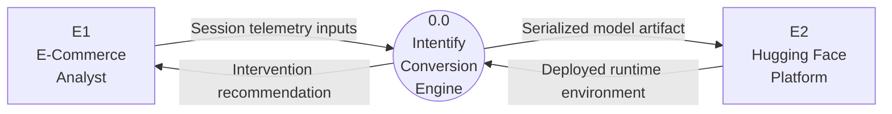

### DFD Level 1 — System Decomposition

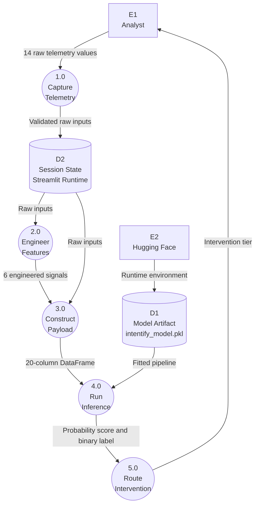

</details>

---

## 🔒 Security Considerations

| Concern | Status | Notes |
|---|---|---|
| **Data Leakage** | ✅ Mitigated | `ColumnTransformer` fitted on train split only; test data never seen during preprocessing |
| **Model Artifact Integrity** | ⚠️ Monitor | `intentify_model.pkl` is a Python pickle — only load from trusted sources |
| **Edge-Case Stability** | ✅ Handled | Laplace smoothing (`+1`) prevents division-by-zero on zero-page sessions |
| **Unknown Categories** | ✅ Handled | `OneHotEncoder(handle_unknown='ignore')` silently drops unseen categories at inference |
| **Input Validation** | ℹ️ Streamlit-level | Slider bounds enforce valid ranges; no SQL/script injection surface |

---

## ⚡ Performance Optimizations

| Optimization | Implementation | Impact |
|---|---|---|
| **Model Caching** | `@st.cache_resource` on `load_engine()` | Eliminates repeated disk reads per user interaction |
| **Parallel GridSearch** | `n_jobs=-1` | Uses all CPU cores during training hyperparameter search |
| **Pipeline Encapsulation** | `sklearn.Pipeline` | Single `predict()` call applies full preprocessing + inference chain |
| **Log Transformation** | `np.log1p(PageValues)` | Reduces PageValues skew; improves tree split quality |
| **Laplace Smoothing** | `+1` in all ratio denominators | Prevents numerical instability on sparse sessions |

---

##  Scalability Design

>  *Current architecture targets single-user interactive demo. Production scaling notes below.*

| Layer | Current | Production Path |
|---|---|---|
| **Inference** | Synchronous Streamlit | REST API (FastAPI) with async inference |
| **Model Serving** | Hugging Face Spaces (single instance) | Containerized service with horizontal scaling |
| **Feature Engineering** | In-app Python | Dedicated feature store or streaming pipeline (Kafka + Flink) |
| **Model Versioning** | Single `.pkl` file | MLflow or DVC artifact registry |
| **Monitoring** | None | Evidently AI for data drift detection |

---

## 🛠️ Engineering Decisions & Tradeoffs

### Decision Tree vs. Gradient Boosting

**Chosen**: `DecisionTreeClassifier` with `GridSearchCV`
**Why**: Fully interpretable — each prediction can be traced to a human-readable rule path. In e-commerce marketing, explainability is critical for business trust and regulatory compliance.
**Tradeoff**: Lower raw F1 vs. XGBoost/LightGBM. Mitigated via careful hyperparameter pruning (`max_depth`, `min_samples_leaf`).

### Algorithmic Imbalance Handling vs. SMOTE

**Chosen**: `class_weight='balanced'`
**Why**: SMOTE generates synthetic minority samples that may not reflect real session dynamics. Algorithmic penalization adjusts the loss directly without introducing artificial data points.
**Tradeoff**: Slightly lower precision on minority class vs. SMOTE. Acceptable given the goal of maximizing **Recall** (capture all buyers).

### Laplace Smoothing in Feature Engineering

**Chosen**: `+1` denominator in all ratio features
**Why**: Sessions with zero product page visits (pure bounces) would produce division-by-zero errors in `avg_time_per_product` and `product_page_ratio`.
**Tradeoff**: Slight distortion of true ratio values for very-low-page sessions. Negligible at dataset scale.

### F1 as GridSearchCV Scoring Metric

**Chosen**: `scoring='f1'`
**Why**: On a 3.8% minority class, accuracy is a deceptive metric. A trivial "predict non-buyer always" model achieves ~96% accuracy. F1 forces the optimizer to balance precision and recall.

---

## Future Roadmap

- [ ] **Real-Time Session Streaming**: Integrate Kafka producer/consumer for live clickstream ingestion
- [ ] **Gradient Boosting Upgrade**: A/B test XGBoost vs. current DT with identical feature set
- [ ] **SHAP Explainability**: Add SHAP waterfall plots to Streamlit for per-prediction feature attribution
- [ ] **REST API Layer**: FastAPI wrapper for headless integration with e-commerce backends
- [ ] **A/B Testing Module**: Track intervention effectiveness (conversion rate lift post-discount)
- [ ] **Model Drift Monitoring**: Evidently AI integration for distribution shift detection
- [ ] **Multi-Model Ensemble**: Combine DT + Logistic Regression for probability calibration
- [ ] **Database Integration**: Session logging to PostgreSQL for audit trail and retraining pipeline

---

## Production Incident Post-Mortems

> Real deployment failures encountered and resolved during the Hugging Face Spaces release of Intentify. Documented as engineering artefacts for operational reference and future onboarding.

---

### Incident 01 — CI/CD Pre-Receive Hook Rejection via Binary Bloat

| Field | Detail |
|---|---|
| **Symptom** | `remote: rejected` — Server-side pre-receive hook declined the push transaction |
| **Severity** | Push pipeline completely blocked; no commits reaching remote |
| **Status** | ✅ Resolved |

**Root Cause Analysis**

Git's internal Directed Acyclic Graph (DAG) is optimized for diffing plaintext source code. The inclusion of a large binary asset (`Supervised ML _Assignment4.pdf`) triggered the upstream VCS firewall, which blocks large binaries to prevent remote storage exhaustion. Because Git relies on an immutable historical ledger, appending a subsequent deletion commit failed to purge the binary blob from the historical object tree — the blob remained embedded in prior DAG nodes.

**Remediation Strategy**

Executed a hard localized repository reset (`rm -rf .git`) to sever the corrupted commit timeline. Re-initialized the local repository state, injected a strict `.gitignore` exclusion policy for binary extensions (`*.pdf`, `*.pkl` optionally), and executed a forced upstream push to the cloud remote.

```bash
# Step 1: Destroy corrupted local history
rm -rf .git

# Step 2: Re-initialize clean repository
git init
git remote add origin <remote-url>

# Step 3: Inject .gitignore exclusion policy
echo "*.pdf" >> .gitignore
echo "Supervised ML _Assignment4.pdf" >> .gitignore

# Step 4: Stage, commit, force push
git add .
git commit -m "fix: remove binary bloat, reinitialize clean history"
git push --force origin main
```

> **Mitigation Alternative**: Implement Git LFS (Large File Storage) for pointer-based object storage decoupling — binary content is offloaded to LFS object store while the DAG retains only a lightweight pointer.

---

### Incident 02 — Container Build Exhaustion via C-Source Compilation

| Field | Detail |
|---|---|
| **Symptom** | Deployment container lifecycle timed out during dependency resolution: `Downloading pandas 2.2.0.tar.gz → Installing build dependencies: still running...` |
| **Severity** | Complete deployment failure; Hugging Face Space stuck in build loop |
| **Status** | ✅ Resolved |

**Root Cause Analysis**

The deployment manifest (`requirements.txt`) rigidly pinned `pandas` and `numpy` to legacy semantic versions. The cloud provider's abstracted container runtime had recently migrated to the **CPython 3.13** interpreter. Lacking pre-compiled binary `.whl` (wheel) distributions for the target OS architecture and interpreter version, `pip` defaulted to fetching `.tar.gz` source archives. This initiated a heavy, unoptimized C/C++ compilation subroutine via the build backend (`setuptools` + `Cython`), leading to severe CPU throttling and an eventual runtime timeout.

**Remediation Strategy**

Deprecated strict semantic version pinning for the data manipulation libraries. Relaxing this dependency resolution heuristic allowed `pip` to fetch the latest OS/Interpreter-compatible pre-compiled wheel binaries from PyPI, reducing deployment overhead from an indefinite pipeline hang to sub-minute container provisioning.

```diff
# requirements.txt — Before (strict pinning causing source compilation)
- pandas==2.2.0
- numpy==1.26.4

# requirements.txt — After (flexible pinning allowing wheel resolution)
+ pandas>=2.2.0
+ numpy>=1.26.0
```

> **Lesson**: Always verify that pinned versions have published `.whl` binaries for the target runtime's Python version and OS architecture on [PyPI](https://pypi.org) before locking versions in a cloud deployment manifest.

---

### Incident 03 — Deserialization Schema Drift (Environment State Asymmetry)

| Field | Detail |
|---|---|
| **Symptom** | Container build succeeded, but inference runtime crashed with: `InconsistentVersionWarning` → `AttributeError: Can't get attribute '_RemainderColsList'` |
| **Severity** | Silent deployment success masking runtime failure; all predictions returning 500 |
| **Status** | ✅ Resolved |

**Root Cause Analysis**

The dependency unpinning applied in Incident 02 inadvertently allowed the production environment to pull `scikit-learn==1.8.0`. The `intentify_model.pkl` artifact, however, was serialized via Python's internal byte-stream protocol (`pickle`) under `scikit-learn==1.6.1`. The architectural schema of the `ColumnTransformer` class underwent significant structural refactoring between these versions. During in-memory deserialization, the unpickler attempted to map byte-stream objects to deprecated internal class attributes — a **schema drift** — resulting in an unhandled `AttributeError` and process termination.

```
# Full error chain
InconsistentVersionWarning: Trying to unpickle estimator ColumnTransformer
from version 1.6.1 when using version 1.8.0.
AttributeError: Can't get attribute '_RemainderColsList' on
<module 'sklearn.compose._column_transformer'>
```

**Root Cause Diagram**

```
Training Environment          Production Environment
─────────────────────         ──────────────────────
scikit-learn==1.6.1           scikit-learn==1.8.0   ← version drift
        │                              │
joblib.dump(pipeline)          joblib.load(pipeline)
        │                              │
   ColumnTransformer                   │
   _RemainderColsList ──── MISSING ────┘
   (internal attribute)       AttributeError → crash
```

**Remediation Strategy**

Enforced strict environment parity by explicitly locking the ML framework version in the deployment manifest, guaranteeing a symmetric match between the local training environment's serialization state and the remote cloud runtime's deserialization logic.

```diff
# requirements.txt — Final locked state
+ scikit-learn==1.6.1   # MUST match training environment exactly
  pandas>=2.2.0
  numpy>=1.26.0
  streamlit==1.32.0
  joblib==1.3.2
```

> **Lesson**: For any project shipping a `.pkl` artifact, **scikit-learn must be pinned at the exact patch version** used during `joblib.dump()`. Flexible pinning is safe for data libraries (`pandas`, `numpy`) but catastrophic for the serialization framework. The correct workflow: train → note sklearn version → pin that version in deployment manifest → serialize → deploy.

---

## Troubleshooting

| Issue | Cause | Fix |
|---|---|---|
| `remote: rejected` on git push | Large binary in commit history (e.g. PDF) triggers pre-receive hook | `rm -rf .git`, reinitialize, add `.gitignore` for binaries, force push — see Incident 01 |
| Build timeout on Hugging Face Spaces | Pinned version lacks pre-built wheel for runtime Python version; triggers C source compilation | Relax pandas/numpy version pins to `>=` — see Incident 02 |
| `AttributeError: Can't get attribute '_RemainderColsList'` | `intentify_model.pkl` deserialized with mismatched sklearn version | Pin `scikit-learn` to exact version used during training — see Incident 03 |
| `ValueError: Feature names mismatch` | Column order in payload doesn't match training schema | Ensure `session_payload` columns match `ColumnTransformer` feature lists exactly |
| `ModuleNotFoundError: joblib` | Missing dependency | `pip install -r requirements.txt` |
| `StreamlitAPIException` | Streamlit version mismatch | Pin to `streamlit==1.32.0` as specified in requirements |
| Division by zero in feature engineering | Laplace smoothing missing | Verify `+1` is present in all ratio denominators in `app.py` |

---

## FAQ

**Q: Why is the model's F1-score 0.61 if Recall is 86%?**
A: High Recall with moderate F1 indicates the model has lower Precision — it correctly identifies 86% of buyers, but also flags some non-buyers as high-intent. This is an acceptable tradeoff: a missed buyer (False Negative) costs more than a wasted discount (False Positive).

**Q: Can I replace the Decision Tree with a Random Forest?**
A: Yes. Replace `DecisionTreeClassifier` with `RandomForestClassifier` in `shopSense.ipynb` and update the `param_grid` accordingly. The `ColumnTransformer` preprocessing layer is model-agnostic.

**Q: Why are `OperatingSystems`, `Browser`, `Region`, and `TrafficType` treated as categorical?**
A: These are nominal IDs (1, 2, 3...) with no ordinal relationship. Treating them as numeric would force the model to assume OS 3 is "greater than" OS 2, which is semantically incorrect.

**Q: Why is `PageValues` kept and not dropped as leakage?**
A: `PageValues` represents a Google Analytics-computed metric for pages visited *before* the transaction endpoint — it is a behavioral signal, not a target-derived feature. The notebook explicitly comments: `# NO PageValues drop — it is a valid session behaviour signal, not leakage`.

---

## Contributing

```bash
# 1. Fork the repository
# 2. Create a feature branch
git checkout -b feature/your-feature-name

# 3. Commit changes
git commit -m "feat: describe your change"

# 4. Push and open a Pull Request
git push origin feature/your-feature-name
```

---

## License

This project is licensed under the **MIT License** — see [LICENSE](LICENSE) for details.


---
